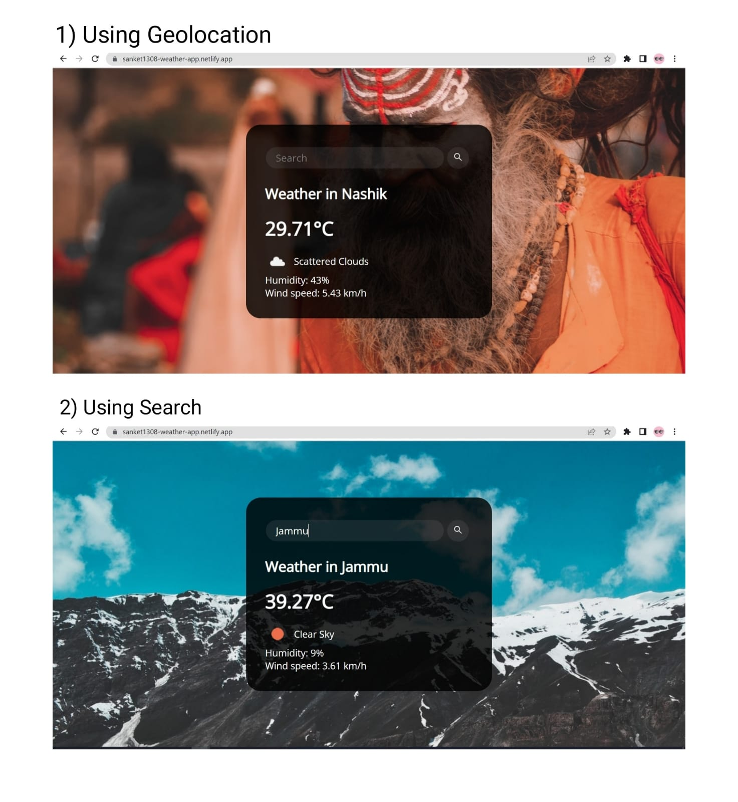

# Weather App using openweathermap API ⛅

Created this Weather Forecasting website using [Openweathermap API](https://openweathermap.org/api) 

# Features 🌟
👉 Search and get weather of any particular location.   
👉 Get current city weather using geolocation.  
👉 See images of city along with the weather.  
👉 Responsive Design.  

## Check out the project here 💻

[https://sanket1308-weather-app.netlify.app](https://sanket1308-weather-app.netlify.app/)

## Contributing 🏆
Contributions are always welcome!
See `contributing.md` for ways to get started.
Please adhere to this project's `code of conduct`.

## Documentation 📃
[Documentation](https://openweathermap.org/api)

## License 📱

[MIT](https://choosealicense.com/licenses/mit/)

## Feedback 🙋‍
If you have any feedback, please reach out to us at boradesanket13@gmail.com

## Links 🔗

